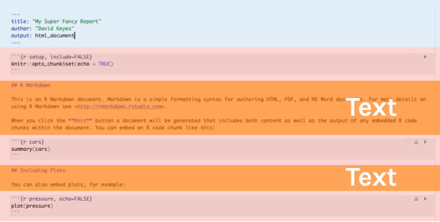
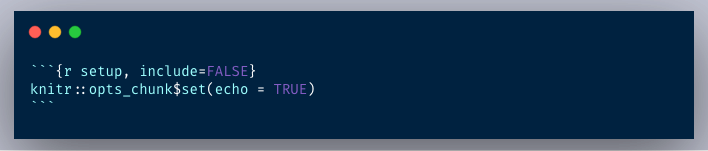

```{r packages, include=FALSE}
library(tidyverse)
#renderthis::to_pdf("01-main-slides.Rmd")
```

class: center, middle, inverse, dk-section-title

**Slides adapted from David Keyes (@dgkeyes), Danielle Navarro (@djnavarro), and Paul Campbell (@paulcampbell91)**

---
class: center, middle, inverse, dk-section-title

# Agenda

--

Logistics

--

Quick intro to RMarkdown

--

Our dataset

--

Data Wrangling

--

Tips & Resources

---


class: center, middle, inverse, dk-section-title

# Logistics

---
Download the materials: https://github.com/Joscelinrocha/Rladies-Wrangling-Data-in-the-Tidyverse


---


class: center, middle, inverse, dk-section-title

# R markdown

---

Art by @allison_horst

---

# RMarkdown Overview

--

Every RMarkdown document has the following:


---
## Knitting (aka Export)


---

## YAML


--
Stands for "YAML Ain't Markup Language"

--

Where you add title, author, date, output options, etc. 

---

## Text



---

## Text


.pull-left[
**Markdown**

```
Text with **some words in bold** 
and *some words in italics*

```

]

--

.pull-right[
**Output**

Text with **some words in bold** and *some words in italics*

]


---

## Headers


.pull-left[
**Markdown**

```


# First-Level Header

## Second-Level Header

### Third-Level Subheader


```
]

--

.pull-right[
**Output**

# First-Level Header

## Second-Level Header

### Third-Level Subheader

]

---

## Lists

.pull-left[
**Markdown**

```
- Bulleted list item
- Bulleted list item


1. Numbered list item
1. Numbered list item
```
]

--

.pull-right[
**Output**


- Bulleted list item #1
- Bulleted list item #2


1. Numbered list item #1
1. Numbered list item #2

]

---

# Code Chunk


They start with three backticks and {r} and end with three backticks. 


---


---

## Insert a Code Chunk: Button


---

## Insert a Code Chunk: Keyboard Shortcut


.pull-left[


**Windows**

*control+alt+i*     


]

--
.pull-right[


**Mac**

*command+option+i*
]                                           
                                               
---

## Chunk Options

**Other options** that we won't discuss today:

- **`warning`** (show any warnings that R throws)
- **`message`** (show any messages that R sends)
- **`fig.width`** (default figure width)
- **`fig.height`** (default figure height)
- **`echo`** (show the R code in the knitted report)
- and many more ...

---

## Setup Code Chunk

--

A special code chunk with the text `setup` right after the `r`. 



--

All chunk options can be set at the **global level** (in the setup code chunk) or at the **chunk level** (for individual chunks).

--

Options at the individual chunk level **override** global chunk options.


---


class: center, middle, inverse, dk-section-title

# Our Dataset

---

## Child Health and Development Studies (CHDS)

.pull-left[
*"Birth weight, date, and gestational period collected as part of the Child Health and Development Studies in 1961 and 1962. Information about the baby's parents — age, education, height, weight, and whether the mother smoked is also recorded."*
]

.pull-right[

]


- Website: https://www.stat.berkeley.edu/users/statlabs/papers/sample.pdf
- R package: https://vincentarelbundock.github.io/Rdatasets/doc/mosaicData/Gestation.html

---


---

class: inverse, center, middle, dk-section-title

# Tidyverse

---


---

class: center, middle

## The Pipe

.pull-left[]
.pull-right[]

---

### The Pipe

I would read each pipe as "then." For example:

```{r eval=FALSE, include=TRUE}
data %>% 
  filter(age < 25) %>% 
  group_by(ed) %>% 
  summarize(mean_gestation = mean(gestation, na.rm = TRUE))

```

---
Art by @allison_horst


---
## Shortcuts

.pull-left[


**Windows**  

*control-shift-M*]

--
.pull-right[


**Mac**

*command-shift-M* ]
---

- These are the functions we will go over:

  <ol start=1>
  .pull-left[
  <li> rename
  <li> clean_names
  <li> toupper/tolower
  <li> separate/unite
  <li> select  
  <li> filter
  ]
 
  <ol start=7>
  .pull-right[
  <li> mutate
  <li> case_when
  <li> summarize
  <li> group_by
  <li> relocate
  <li> pivot_longer/pivot_wider
]

